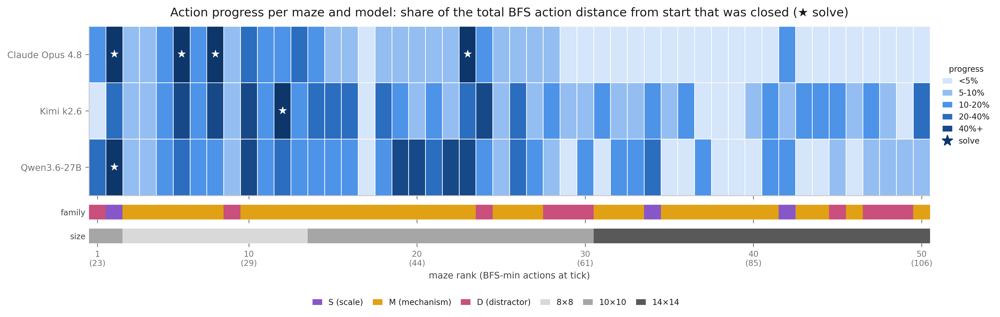

# How does your agent do on cross-domain, multimodal, long-horizon tasks?

<p align="center">
  
  <br>
  <em>Claude Opus 4.8, Kimi K2.6 and Qwen 3.6 27B models failing on 2D mazes.</em>
</p>

## 🔍 A Preview of our Multi-Domain Agentic Benchmark

We aim to build interactive environments that are proxies for real-world scenarios. However, at the same time we are keen to keep the setup controllable, which will allow us to deterministically vary parameters in our environment in order to make it easier or more difficult for models to succeed in.

The capabilities we aim to benchmark are long-horizon action taking and causal reasoning, which involves various sub-capabilities such as planning, action execution, error recovery, visual object association, and so much more. A simple underlying substrate that brings all these aspects together for an environment and benchmarking task is a maze with mechanisms. Additionally, mazes with mechanisms are projectable into multiple domains: the same maze can be re-rendered in language or 3D or many other domains, quantifying cross-domain generalization. In this release, we evaluated 3 frontier VLMs on 50 2D mazes.

## 🧩 What we built

- **The environment:** 8×8 to 14×14 [MiniGrid](https://github.com/Farama-Foundation/Minigrid) mazes with an action space containing 6 valid actions: turn left, turn right, move forward, pickup, toggle, and done. The agent must navigate corridors, dead ends, distractors and decoys, operate mechanisms in the right order and reach a goal tile.
- **A validator and BFS oracle:** every maze is confirmed solvable, with checks for mechanism necessity, chain ordering, and distractor safety. The oracle yields the exact optimal action sequence from any reachable state, giving objective difficulty, partial credit, and the ability to label a single move as strictly wrong.
- **An evaluation harness:** a config-driven episode runner (prompt assembly, strict action parsing, per-episode artifact logging, a progress-stall watchdog, difficulty-relative step caps), model adapters behind one interface, mechanism-aware scoring, and the distributed run infrastructure that executed the evaluation across a fleet of VMs and GPUs.
- **An ablation-derived protocol:** extensive experiments were run across 540 episodes to finalize the evaluation protocol for the final run on 50 mazes.

## 📊 A peek into the results

We evaluated **Claude Opus 4.8** (xhigh thinking), **Kimi k2.6** (thinking), and **Qwen3.6-27B** (thinking) on 50 difficulty-balanced mazes, with an equal 64k output-token budget.

<div align="center">
<table>
  <thead>
    <tr>
      <th></th>
      <th>Claude Opus 4.8</th>
      <th>Kimi k2.6</th>
      <th>Qwen3.6-27B</th>
    </tr>
  </thead>
  <tbody>
    <tr>
      <td>Mazes solved (/50)</td>
      <td align="center">4</td>
      <td align="center">1</td>
      <td align="center">1</td>
    </tr>
    <tr>
      <td>Mean action progress</td>
      <td align="center">0.19</td>
      <td align="center">0.23</td>
      <td align="center">0.23</td>
    </tr>
  </tbody>
</table>
</div>

**6 solves out of 150 episodes. 45 of the 50 mazes were solved by no model at all.** These are puzzles a person who has never seen one solves in a few minutes. Try out some of the mazes and see how you fare!

<p align="center">
  
  <br>
  <em>Progress per maze (columns) per model (rows); stars mark the six solves.</em>
</p>

## 🚀 Quickstart

```bash
conda create -n maze-benchmark python=3.10
conda activate maze-benchmark
pip install -e ".[dev,visual]"
```

Mazes are declarative JSON task specifications. Validate every example spec in the repo and rank them by difficulty:

```bash
python -m gridworld.task_validator
```

```
  [PASS] tier3_key_switch_001: optimal=30 steps, mechanisms=4, score=70.61
  ...
=== Summary: 16/16 tasks beatable ===
```

To build your own maze, copy a spec from `gridworld/tasks/`, edit the layout and mechanisms, then validate and render it:

```python
from PIL import Image

from gridworld.task_spec import TaskSpecification
from gridworld.task_validator import compute_difficulty
from gridworld.backends.minigrid_backend import MiniGridBackend

spec = TaskSpecification.from_json("gridworld/tasks/tier3/key_switch_001.json")

report = compute_difficulty(spec)
print(report.is_beatable, report.optimal_steps, report.mechanism_count)

backend = MiniGridBackend()
backend.configure(spec)
backend.reset(seed=0)
Image.fromarray(backend.render()).save("maze.png")
```

`compute_difficulty` runs the BFS oracle: if your maze is unsolvable, has a decorative mechanism, or has a distractor that can strand the agent, it will tell you.

## 📁 Repository structure

| Path | Contents |
|---|---|
| `gridworld/` | task specification, maze validator, BFS oracle, MiniGrid + MultiGrid backends |
| `interface/` | episode runner, prompt assembly, action parsing, model adapters |
| `prompting_experiments/` | every prompt template used in the protocol sweep |
| `scorer/` | static and runtime scoring, mechanism-aware progress |
| `demo/` | the playable maze demo |
| `scripts/` | evaluation pipeline entrypoints and run tooling |


