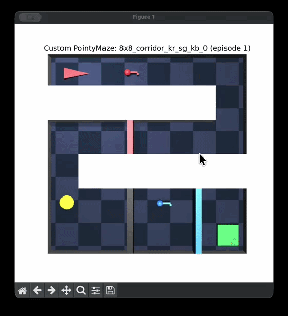

**Maze Action Space**

* no mechanisms: Box(-1.0, 1.0, (2,), float32)
  * ← → to change heading, up to go forward, down to back
* with mechanisms: Tuple(Box(-1.0, 1.0, (2,), float32), Discrete(3))
  *  P to pick key, I to interact with switch and door

**Maze Generation Pipeline**

1. Come up with one navigation base maze per base maze type with Claude. Manually verify that there is one path from start to goal.

   

2. Decide where to add 3 mechanisms and add the depth-3 mechanism chain first. In a key door → switch gate → key door chain, make sure that the switch comes after the previous door, and the last key comes after the gate on the path to goal. Also make the mechanisms spread out along the path to the goal.

   

3. Make the shorter chain variants by taking away mechanism locations from the back. For example, in the red key door → switch gate → blue key door chain, the blue door is at [5, 5], the blue key is at [4, 5]. Take away these two locations and put the remaining two mechanisms in the remaining locations. Then take away the middle mechanism's locations and put the remaining one mechanism in the remaining locations. 

   

   

   

4. To generate more batches of mazes, repeat the above steps.

**Naming Convention**

* dense = “dense maze with dead ends”
* corridor = “winding corridor”
* sg = “switch gate”
* kr = red key followed by a red door
* kb = blue key followed by a blue door
* {sizexsize}_{base_maze_type}_{mechanisms}_{maze_type#}.json
  * example: 8x8_empty_room_0.json, 10x10_corridor_kr_1.json, 14x14_dense_kr_sg_kb_0.json

